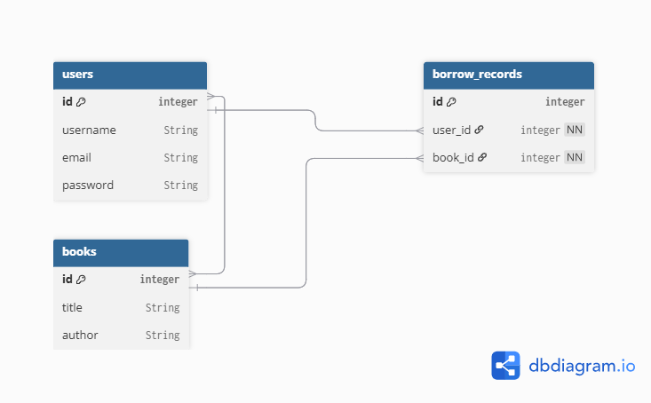

#Books Module

* GET    /books        → كل الكتب
* GET    /books/{id}   → كتاب واحد
* POST   /books        → إضافة كتاب
* PUT    /books/{id}   → تعديل
* DELETE /books/{id}   → حذف

## Relations




###User->borrow->book
1-book shoud be exist
2-check user exist
3-book not borrowed
4-make history to borrow_records

###return
*if record(user_id+book_id) is exist Delete it

###Flow login
User → login → verify password → generate token → return token


## Docker (Simple)

1) Run containers:

```bash
docker compose up --build
```

2) Open:

- API: `http://127.0.0.1:8001`
- Docs: `http://127.0.0.1:8001/docs`
- Monitoring: `http://127.0.0.1:8001/monitoring`

3) Stop containers:

```bash
docker compose down
```
